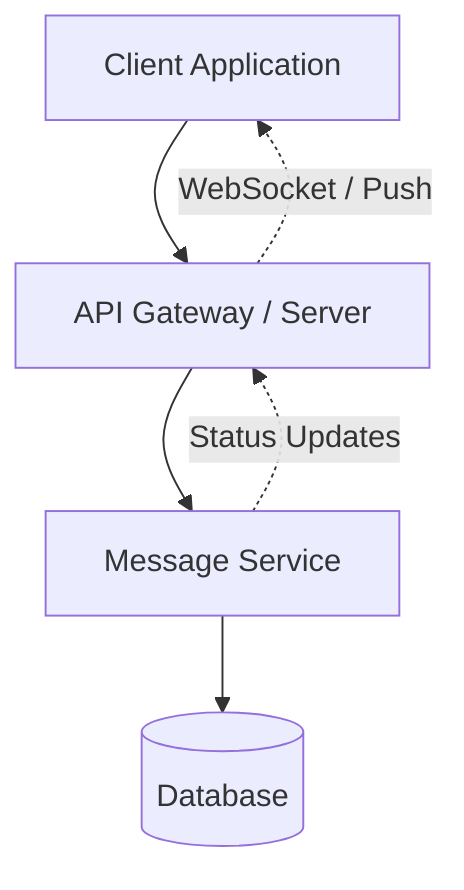
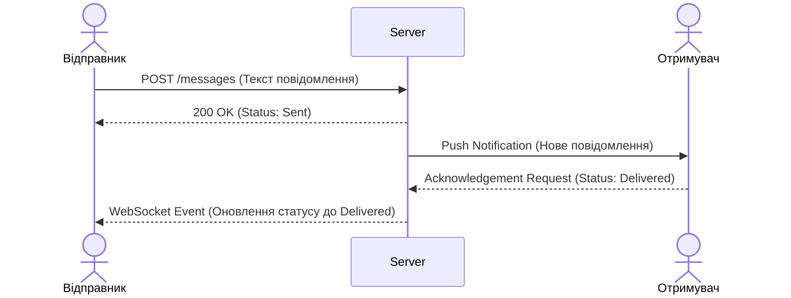
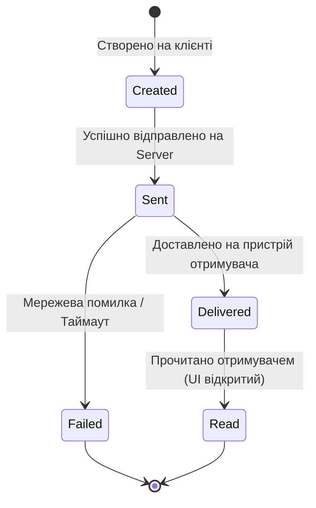

# Лабораторна робота №1: System Design
**Варіант:** 2 (Message Status Tracking)

## Part 1: Component Diagram (30%)
**Опис:** Загальна архітектура системи відстеження статусів повідомлень. Client Application взаємодіє з сервером через API Gateway. Message Service відповідає за бізнес-логіку обробки повідомлень та збереження їх у Database. Для доставки оновлень статусів в реальному часі від сервера до клієнта використовується WebSocket або механізм Push-сповіщень.

## Part 2: Sequence Diagram (25%)
**Опис:** Сценарій відправки повідомлення та оновлення його статусу до `Delivered` (доставлено на пристрій отримувача).

## Part 3: State Diagram (20%)
**Опис:** Життєвий цикл повідомлення та зміна його статусів (State) у системі.

## Part 4: ADR (Architecture Decision Record) (25%)

### ADR: Use Client Acknowledgements for Message Status Tracking

#### Status
Accepted

#### Context
Системі необхідно точно визначати момент, коли повідомлення було фактично доставлено на девайс отримувача та коли воно було прочитане. Покладатись виключно на факт відправки Push-сповіщення сервером неможливо, оскільки воно може загубитися, або пристрій може бути без доступу до мережі.

#### Decision
Використовувати механізм явних підтверджень (Client Acknowledgements). Клієнтський додаток отримувача ініціює спеціальний запит на сервер із зазначенням нового статусу (`Delivered` або `Read`) в момент завантаження повідомлення на пристрій або його відображення на екрані користувача.

#### Alternatives
- Відстеження статусу лише за фактом відправки повідомлення в канал WebSocket/Push з боку сервера (rejected - не гарантує факту отримання пристроєм).
- Регулярне опитування (Polling) клієнтом сервера для синхронізації статусів (rejected - створює надмірне та постійне навантаження на сервер).

#### Consequences

Плюси:  
+ Точне та достовірне відображення статусів, що відповідає реальному стану на пристрої отримувача.
+ Стійкість до втрати Push-сповіщень або тимчасових розривів з'єднання.

Мінуси:  
- Збільшення кількості вхідних запитів до сервера, що підвищує навантаження.
- Ускладнення логіки клієнтського додатка (необхідність відстежувати видимість елемента на екрані для статусу `Read`).
